# Records Store

A comprehensive demo application for learning and practicing **SRE**, **observability**, and **incident management** concepts. This project simulates a record store e-commerce application with integrated observability tools for metrics, logs, and distributed tracing.

## 🎯 Overview

The KodeKloud Records Store application demonstrates a complete observability solution built on modern best practices. It serves as a hands-on learning environment for:

- Setting up comprehensive monitoring and observability
- Implementing distributed tracing in applications
- Designing effective alerting strategies  
- Practicing incident response using real-world scenarios
- Learning SLO-based monitoring approaches
- Understanding Prometheus metrics best practices

## 🏗️ Architecture

This is a **multi-component monolith** application with the following components:

### Application Components
- **FastAPI Web Service** - Main application serving REST API endpoints
- **Celery Background Worker** - Asynchronous task processing (same codebase)
- **PostgreSQL Database** - Data persistence
- **RabbitMQ** - Message queue for background task distribution

### Observability Stack
- **Prometheus** - Metrics collection and storage
- **Grafana** - Visualization and dashboards  
- **Jaeger** - Distributed tracing
- **Loki** - Log aggregation
- **Fluent Bit** - Log collection and forwarding
- **AlertManager** - Alert handling and notifications
- **Blackbox Exporter** - Synthetic monitoring
- **Pushgateway** - Metrics from batch jobs

### Simple Architecture Diagram

```mermaid
graph TB
    subgraph "KodeKloud Records Store Application"
        Client[👤 Client] --> API[FastAPI Web Service<br/>Port: 8000]
        API --> DB[(PostgreSQL<br/>Port: 5432)]
        API --> MQ[RabbitMQ<br/>Port: 5672]
        MQ --> Worker[Celery Worker<br/>Background Tasks]
        Worker --> DB
    end
    
    subgraph "Observability Stack"
        API --> Prometheus[📊 Prometheus<br/>Port: 9090]
        API --> Jaeger[🔍 Jaeger<br/>Port: 16686] 
        API --> Fluent[📝 Fluent Bit]
        Worker --> Prometheus
        Worker --> Jaeger
        Worker --> Fluent
        
        Fluent --> Loki[📚 Loki<br/>Port: 3100]
        Prometheus --> Grafana[📈 Grafana<br/>Port: 3000]
        Prometheus --> AlertManager[🚨 AlertManager<br/>Port: 9093]
        Loki --> Grafana
        Jaeger --> Grafana
        
        Blackbox[🎯 Blackbox Exporter<br/>Port: 9115] -.-> API
        Pushgateway[📤 Pushgateway<br/>Port: 9091] --> Prometheus
    end
    
    classDef app fill:#e1f5fe,stroke:#01579b,stroke-width:2px
    classDef obs fill:#fff3e0,stroke:#e65100,stroke-width:2px
    classDef storage fill:#e8f5e8,stroke:#2e7d32,stroke-width:2px
    
    class Client,API,Worker app
    class Prometheus,Grafana,Jaeger,Loki,Fluent,AlertManager,Blackbox,Pushgateway obs
    class DB,MQ storage
```



### Request Flow


## 📂 Project Structure

```
kodekloud-records-store-web-app/
├── src/
│   ├── api/
│   │   ├── main.py              # FastAPI application entry point
│   │   ├── routes.py            # API endpoints (products, orders, checkout)
│   │   ├── models.py            # Database models (Product, Order)
│   │   ├── database.py          # Database connection and session management
│   │   ├── worker.py            # Celery background tasks
│   │   ├── telemetry.py         # OpenTelemetry setup
│   │   └── metrics.py           # Prometheus metrics definitions (BEST PRACTICES)
│   └── requirements.txt         # Python dependencies
├── config/
│   └── monitoring/              # Observability configuration
│       ├── prometheus.yml       # Prometheus scrape config
│       ├── alertmanager.yml     # Alert routing rules
│       ├── alert_rules.yml      # Prometheus alerting rules
│       ├── sli_rules.yml        # SLI measurement rules
│       └── grafana-provisioning/ # Grafana dashboards & datasources
├── deploy/
│   └── environments/            # Environment configuration
│       ├── setup-local-env.sh   # 🔧 Environment setup script
│       └── templates/           # Environment variable templates
│           ├── env.dev.template
│           ├── env.staging.template
│           └── env.prod.template
├── scripts/
│   ├── generate_logs.sh         # Generate test log data
│   └── demo_request_correlation.sh # Demo request tracing
├── docker-compose.yaml          # 🐳 Complete stack definition
├── Dockerfile                   # Application container image
├── test_traffic.sh              # 🚀 Generate test traffic
└── black_box_monitor.sh         # 📊 Synthetic monitoring
```

## 🚀 Getting Started

### Prerequisites

- **Docker Desktop** (recommended) or Docker + Docker Compose
- **Git**
- **curl** (for testing)

### 📝 Step-by-Step Setup Instructions

#### 1. Clone the Repository
```bash
git clone <your-repo-url>
cd kodekloud-records-store-web-app
```

#### 2. Set Up Environment Variables
```bash
# Run the environment setup script (creates .env.dev with safe defaults)
./deploy/environments/setup-local-env.sh

# Verify the environment file was created
cat .env.dev
```

The setup script creates a `.env.dev` file with these defaults:
- Database: `dev_user` / `dev_password_123` 
- Grafana: `admin` / `dev_admin_123`
- Service name: `kodekloud-record-store-api-dev`

#### 3. Start the Complete Stack
```bash
# Start all services (application + observability)
docker-compose --env-file .env.dev up -d

# Check all services are running
docker-compose ps
```

#### 4. Verify Everything is Working
```bash
# Test the API
curl http://localhost:8000/

# Check metrics endpoint
curl http://localhost:8000/metrics

# Check health
curl http://localhost:8000/health
```

### 🔗 Access the Services

| Service | URL | Credentials |
|---------|-----|-------------|
| **Records Store API** | http://localhost:8000 | N/A |
| **API Documentation** | http://localhost:8000/docs | N/A |
| **Grafana Dashboards** | http://localhost:3000 | admin / dev_admin_123 |
| **Prometheus** | http://localhost:9090 | N/A |
| **Jaeger Tracing** | http://localhost:16686 | N/A |
| **Loki Logs** | http://localhost:3100 | N/A |
| **AlertManager** | http://localhost:9093 | N/A |
| **RabbitMQ Management** | http://localhost:15672 | guest / guest |

## 🧪 Testing and Exploration

### Generate Test Data

```bash
# Generate test traffic (products, orders, errors)
./test_traffic.sh

# Generate logs for correlation testing  
./scripts/generate_logs.sh

# Run synthetic monitoring
./black_box_monitor.sh
```

### API Endpoints to Test

```bash
# Basic endpoints
curl http://localhost:8000/                    # Root
curl http://localhost:8000/health              # Health check
curl http://localhost:8000/metrics             # Prometheus metrics

# Observability testing endpoints  
curl http://localhost:8000/trace-test          # Generate test traces
curl http://localhost:8000/error-test          # Generate test errors

# Business endpoints
curl http://localhost:8000/products            # List products
curl -X POST http://localhost:8000/products \
  -H "Content-Type: application/json" \
  -d '{"name": "Abbey Road", "price": 25.99}'  # Create product

curl http://localhost:8000/orders              # List orders
curl -X POST http://localhost:8000/orders \
  -H "Content-Type: application/json" \
  -d '{"product_id": 1, "quantity": 2}'        # Create order

curl -X POST http://localhost:8000/checkout \
  -H "Content-Type: application/json" \
  -d '{"product_id": 1, "quantity": 1}'        # Checkout (triggers background tasks)
```

## 📊 Key Learning Features

### 1. **Best Practice Prometheus Metrics**
- **Four Golden Signals** organization (Traffic, Latency, Errors, Saturation)
- **Proper naming conventions** with `kodekloud_` prefix
- **Low cardinality design** to avoid metric explosion
- **Standard histogram buckets** for latency measurements
- **Business metrics** for SLO tracking

### 2. **Distributed Tracing**
- **End-to-end request tracking** through FastAPI → Database → Background Worker
- **Trace correlation** with logs and metrics
- **Performance bottleneck identification**
- **Error propagation analysis**

### 3. **Structured Logging**
- **JSON formatted logs** with trace context
- **Log correlation** across services
- **Centralized collection** with Fluent Bit → Loki

### 4. **SLO-Based Monitoring**
- **Service Level Indicators (SLIs)** for reliability measurement  
- **Service Level Objectives (SLOs)** with error budgets
- **Alerting based on SLO violations** not just symptoms

## 🎓 Student Exercises

### Exercise 1: Explore the Observability Stack
1. Generate some test traffic: `./test_traffic.sh`
2. Open Grafana (http://localhost:3000) and explore the dashboards
3. Open Jaeger (http://localhost:16686) and trace a request end-to-end
4. Check Prometheus (http://localhost:9090) and query some metrics

### Exercise 2: Understand Metric Correlation
1. Make a few API calls that will trigger errors
2. Find the same request in metrics (Prometheus), logs (Loki), and traces (Jaeger)
3. Use trace IDs to correlate between the three data sources

### Exercise 3: Create Custom Metrics
1. Look at `src/api/metrics.py` to understand best practices
2. Add a new business metric (e.g., `kodekloud_products_viewed_total`)
3. Update `src/api/routes.py` to increment your metric
4. Rebuild and test: see your metric in http://localhost:8000/metrics

### Exercise 4: Practice Incident Response
1. Intentionally break something (modify code to cause errors)
2. Use the observability tools to identify and diagnose the issue
3. Practice following traces to find root causes

## 🛠️ Environment Management

### Development Environment Variables

The `setup-local-env.sh` script creates these variables:

```bash
# Database Configuration
POSTGRES_HOST=db
POSTGRES_DB=kodekloud_records_dev
POSTGRES_USER=dev_user
POSTGRES_PASSWORD=dev_password_123

# Application Settings
DEBUG=true
LOG_LEVEL=DEBUG
ENVIRONMENT=development

# OpenTelemetry
OTEL_SERVICE_NAME=kodekloud-record-store-api-dev
OTEL_EXPORTER_OTLP_ENDPOINT=http://jaeger:4317

# Grafana
GRAFANA_ADMIN_PASSWORD=dev_admin_123
```

### Other Environments

- **Staging**: Use `env.staging.template` 
- **Production**: Use `env.prod.template`

Copy and modify templates as needed:
```bash
cp deploy/environments/templates/env.staging.template .env.staging
# Edit .env.staging with your values
docker-compose --env-file .env.staging up -d
```

## 🚨 Troubleshooting

### Common Issues

**Services not starting:**
```bash
# Check for port conflicts
docker-compose ps
netstat -tulpn | grep -E ':(3000|8000|9090|5432)'

# Check Docker resources
docker system df
docker system prune  # Clean up if needed
```

**No metrics in Grafana:**
```bash
# Verify Prometheus targets
curl http://localhost:9090/api/v1/targets

# Check API metrics endpoint
curl http://localhost:8000/metrics | grep kodekloud_
```

**No logs in Loki:**
```bash
# Check Fluent Bit is running
docker-compose logs fluent-bit

# Test log endpoint
curl http://localhost:3100/ready
```

**No traces in Jaeger:**
```bash
# Check OpenTelemetry export
docker-compose logs jaeger

# Generate test traces
curl http://localhost:8000/trace-test
```

### Getting Help

1. **Check service logs**: `docker-compose logs <service-name>`
2. **Verify environment**: `cat .env.dev`  
3. **Test connectivity**: Use the curl commands above
4. **Reset everything**: `docker-compose down -v && docker-compose --env-file .env.dev up -d`

## 🤝 Contributing

This project is designed for learning! Feel free to:
- Add new metrics following the patterns in `src/api/metrics.py`
- Create additional API endpoints in `src/api/routes.py`
- Improve dashboards in `config/monitoring/grafana-provisioning/`
- Add new alerting rules in `config/monitoring/alert_rules.yml`

## 📚 Additional Resources

- [Prometheus Best Practices](https://prometheus.io/docs/practices/)
- [OpenTelemetry Python Guide](https://opentelemetry.io/docs/languages/python/)
- [SLO Concepts](https://sre.google/workbook/implementing-slos/)
- [Grafana Dashboard Examples](https://grafana.com/grafana/dashboards/)

## 📄 License

This project is licensed under the MIT License - see the LICENSE file for details.
